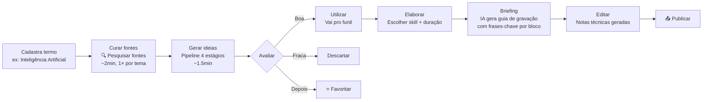

<div align="center">

# 📡 Content Hub

### Pesquisa • Ideação • Produção

**De termos monitorados a conteúdo pronto pra gravar — ancorado em fontes reais, guiado por IA.**

[🎯 Fluxo](#fluxo-do-usuário) · [⚙️ Arquitetura](docs/ARCHITECTURE.md) · [📖 Guia do usuário](docs/USER_GUIDE.md) · [🚀 Setup](#setup-rápido) · [🗺️ Roadmap](#roadmap)

---

</div>

## ✦ O que é

Um app pessoal de produção de conteúdo que transforma **temas de interesse** em **ideias prontas** e depois em **roteiros de vídeo/post** — com pesquisa real, curadoria de fontes e skills especializadas por plataforma.

> **Não é outro ChatGPT wrapper.** Cada ideia vem ancorada em matérias reais de publishers que **você escolheu**, com quote verbatim, triangulação cross-publisher e score de viralidade. Quando vira conteúdo, a skill da plataforma (Reels/Shorts/Long/TikTok) dirige duração, roteiro, hook, título e descrição.

## ✦ Pra quem

- Criador de conteúdo que cobre **temas técnicos, de nicho ou noticiosos** e precisa estar na frente — não depois que o assunto já saturou.
- Quem entende que **qualidade da fonte = qualidade da ideia** e quer parar de depender de Google News genérico.
- Quem produz pra **múltiplas plataformas** e quer skills dedicadas guiando cada formato, não um roteiro genérico.

## ✦ O problema que resolve

| Antes | Com Content Hub |
|---|---|
| Pesquisa "à mão" em 5 tabs abertas, perdendo 2h pra achar pauta | Pipeline roda em ~1.5min e entrega 6 ideias com evidência |
| Ideias genéricas que qualquer influencer pode ter | Triangulação cross-publisher + cross-idioma → viral score real |
| Roteiro colado de "faz pra Reels" pra qualquer formato | 4 skills dedicadas × 3 durações cada = 12 estratégias distintas |
| Fonte perdida no meio do briefing | Bloco de "Fontes" clicável em cada fase, direto do IdeaFeed |
| "Essa ideia já tá em produção ou é nova?" | Card mostra mini-progresso das 5 fases em tempo real |

## ✦ Fluxo do usuário



## ✦ Features principais

### 🎯 Curadoria de fontes profissional
Cada termo tem fontes próprias curadas em 3 estágios de raciocínio:
1. **Decomposição** — subtemas, jargão, perfis-alvo, queries planejadas
2. **Descoberta multi-estratégia** — 6 ângulos de busca (authority, expert_pick, recent_coverage, deep_analysis, newsletter_blog, aggregator_validation)
3. **Validação + ranking** — `site:` por candidato, score em 5 dimensões (autoridade, especialização, frequência, independência, idioma)

Resultado: top 8-15 publishers por tema com nota agregada 0-10 e badge de tier (TIER_1 / TIER_2 / BLOG).

### 🧠 Pipeline de ideação ancorado em fontes
```
RSS (fallback) │ Claude web_search (com allowed_domains)
       ↓                    ↓
       └──► Triagem (Haiku) — lê matéria via web_fetch, classifica
                ↓
            Deep research (Haiku) — triangulação cross-publisher/cross-language
                ↓
            Narrativa (Sonnet) — 6 ideias com hook, ângulo, platformFit
```

**Custo médio por run:** ~$0.15 · **Tempo:** ~1.5min · **Qualidade:** quote verbatim em cada ideia.

### 📱 Skills por plataforma (4 × 3)

| Plataforma | Duração curta | Duração média | Duração longa |
|---|---|---|---|
| **🎞️ Instagram Reels** | 30s Teaser Viral | 60s Fato + Contexto | 90s Mini História |
| **⚡ YouTube Shorts** | 30s Snap Insight | 45s Explicação Clara | 60s Mini Tutorial |
| **🎬 YouTube Long** | 8min Explainer | 15min Análise Profunda | 25min Deep Dive |
| **🎵 TikTok** | 30s Trend Native | 60s Curiosity Stacking | 90s Narrative POV |

Cada combinação tem guide específico pra **hook**, **roteiro**, **título** e **descrição**. A IA não improvisa — segue a estratégia.

### ⭐ Organização que escala

- **3 modos de ideação:** Monitor automático (roda todos os termos) · Tema específico (pesquisa 1 tema) · Ideia própria (sem IA)
- **Ordenação:** recência · pioneer score · viral score
- **Favoritar** ideias com ★ (filtro dedicado, sempre no topo)
- **Cache de evidências** — matérias já lidas não re-fetcham em 1h (economia)
- **Feed de status** em tempo real durante pipeline com os 4 estágios visíveis

### 📊 Observabilidade embutida
- Cada fase do pipeline salva `ApiUsage` (modelo, tokens, custo, duração)
- Dashboard `/conteudo/radar` agrupa evidências por termo, publisher, freshness
- Dá pra auditar "onde estou gastando mais" e "qual termo tem melhor sinal"

### 🔗 Referências clicáveis em todo fluxo
No **Briefing** e na **Elaboração**, um bloco dedicado mostra:
```
📚 Fontes da pesquisa · 3 links · viral 78/100 · 🌎
  PRIMÁRIA  [TIER 1] 🇧🇷  criptofacil.com
            "R$ 3 Bilhões Roubados em 30 Dias..."
            "quote verbatim da matéria"
  APOIO     [TIER 2] 🇺🇸  news.bitcoin.com
  APOIO     [BLOG]   🇧🇷  pt.egw.news
```
Não precisa re-pesquisar pra lembrar de onde veio a história.

## ✦ Stack

| Camada | Tecnologia |
|---|---|
| **Framework** | Next.js 16 (App Router) + TypeScript |
| **Estilo** | Tailwind CSS 4 + Lucide icons |
| **Database** | Postgres (Prisma Data Platform) |
| **ORM** | Prisma 7 com adapter pg |
| **Auth** | NextAuth 5 (credentials + bcrypt) |
| **IA** | Anthropic Claude (Haiku 4.5 + Sonnet 4.6) |
| **Deploy** | Vercel |

## ✦ Setup rápido

**Pré-requisitos:** Node 22+ · Postgres (ou Prisma Data Platform) · Anthropic API Key

```bash
# 1. Clone e instala
git clone git@github.com:nelsonweippert/Cockpitconteudo.git
cd Cockpitconteudo
npm install

# 2. Env vars
cp .env.local.example .env.local  # preencha DATABASE_URL, ANTHROPIC_API_KEY, NEXTAUTH_SECRET

# 3. Migrations + usuário seed
npm run db:migrate
npm run seed:user  # cria usuário default (email no script)

# 4. Rodar
npm run dev  # porta 3020
```

Acesse **http://localhost:3020/login**.

## ✦ Estrutura de pastas

```
cockpitconteudo/
├── src/
│   ├── app/
│   │   ├── (app)/              # rotas autenticadas
│   │   │   ├── conteudo/       # listagem + detalhe + radar
│   │   │   └── layout.tsx      # sidebar + topbar
│   │   ├── (auth)/login/       # credenciais
│   │   ├── actions/            # server actions tipadas
│   │   └── api/
│   │       ├── auth/           # NextAuth handler
│   │       └── content/
│   │           ├── ai/         # gerar hook/título/roteiro/etc
│   │           ├── ideas/      # custom + reclassify
│   │           └── sources/
│   │               └── discover/stage{1,2,3}/  # curadoria em 3 chamadas
│   ├── components/             # IdeaCard, ContentDetailPanel, TermSourcesManager, DatePicker
│   ├── config/content-skills.ts  # 4 skills × 3 durações × guides completos
│   ├── services/
│   │   ├── ai.service.ts           # pipeline de ideias (4 estágios)
│   │   ├── source-discovery.ts     # curadoria de fontes (3 estágios)
│   │   ├── news-feed.service.ts    # RSS + google news decoder
│   │   └── content.service.ts      # CRUD de Content
│   ├── lib/                    # db, auth, utils
│   └── types/                  # tipos compartilhados
├── prisma/
│   ├── schema.prisma           # 6 models (enxuto, só content)
│   └── migrations/             # histórico versionado
├── scripts/
│   ├── seed-user.ts            # cria user inicial
│   └── migrate-from-cockpit.ts # importa dados do cockpit-produtividade
└── docs/                       # esta documentação
```

## ✦ Documentação

- **[ARCHITECTURE.md](docs/ARCHITECTURE.md)** — pipelines detalhados, modelo de custo, decisões técnicas
- **[USER_GUIDE.md](docs/USER_GUIDE.md)** — passo-a-passo completo da primeira ideia ao primeiro vídeo publicado

## ✦ Roadmap

**Próximas entregas:**
- [ ] Deploy em domínio custom
- [ ] Google OAuth (substituir credentials puro)
- [ ] Batch validation no stage 3 (validar fontes em chunks → mais candidatos suportados)
- [ ] Streaming SSE durante pipeline (progresso real por estágio)
- [ ] Histórico de "fontes descartadas" por termo (aprendizado iterativo)
- [ ] Export Content → Markdown / Notion / Google Doc

**Em estudo:**
- [ ] Agente autônomo diário (cron) que já triangula e deixa 3 ideias top-rated no feed
- [ ] Agregação de métricas pós-publicação (Google Analytics, YouTube Analytics)
- [ ] Integração com ferramentas de edição (CapCut, Descript)

---

<div align="center">

**Content Hub** · Construído por **Nelson Weippert** com Claude

Co-development: Claude Opus 4.7 (1M context)

</div>
