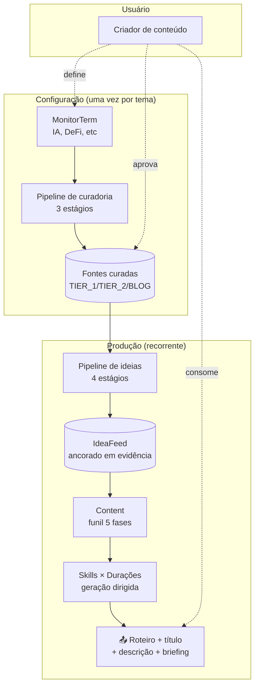
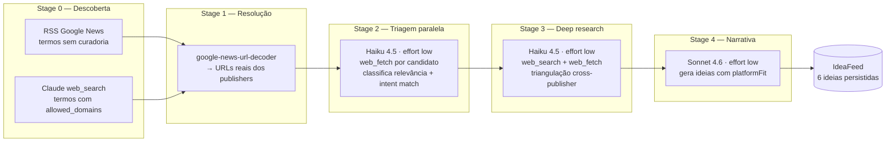

# ⚙️ Arquitetura — Content Hub

Este documento descreve os dois pipelines de IA do produto, decisões técnicas relevantes, modelo de custo e pontos de extensão.

---

## 🗺️ Visão geral



---

## 🎯 Pipeline 1 — Curadoria de fontes (3 estágios)

**Frequência:** 1 vez por tema (rodado raramente, ~$0.30, ~2min)
**Objetivo:** converter um termo solto em 8-15 publishers de qualidade

### Estágio 1 — Decomposição
```
Modelo:    Claude Sonnet 4.6
Tools:     nenhum
Effort:    medium
Duração:   ~15s
```

**Input:** `{ term, intent }`
**Saída:**
- `subtemas[]` — 5-8 subtemas dentro do tema principal
- `jargao[]` — 5-10 termos técnicos de expert real
- `perfis_alvo{}` — descrição do TIER_1, TIER_2, BLOG ideais
- `anti_padroes[]` — 3-8 tipos de fonte a evitar
- `queries[]` — 4-10 queries planejadas com strategy + language

**Estratégias de busca cobertas:**
| Strategy | Exemplo |
|---|---|
| `authority` | "best sources on &lt;tema&gt;" |
| `expert_pick` | "&lt;tema&gt; experts recommend" |
| `recent_coverage` | "&lt;tema&gt; news latest" |
| `deep_analysis` | "&lt;tema&gt; in-depth analysis" |
| `newsletter_blog` | "best newsletter &lt;tema&gt; substack" |
| `aggregator_validation` | "techmeme &lt;tema&gt;" |

> **Por que esse estágio existe:** sem decomposição, Claude faz "best sites about X" genérico. Com decomposição, ele usa jargão real e ataca por múltiplos ângulos.

### Estágio 2 — Descoberta
```
Modelo:    Claude Sonnet 4.6
Tools:     web_search (6 uses)
Effort:    low
Duração:   ~20s
```

**Input:** decomposition do estágio 1
**Saída:** 20-40 candidatos brutos `{ host, name, language, preliminaryTier, foundVia[], snippet }`

**O que faz:**
- Executa as queries planejadas via `web_search`
- Agrega hosts que aparecem nos resultados
- Registra em `foundVia` quais estratégias trouxeram cada host (sinal de qualidade — aparecer em múltiplas = mais forte)
- **NÃO filtra por qualidade ainda** — deixa pro estágio 3

### Estágio 3 — Validação + Ranking
```
Modelo:    Claude Sonnet 4.6
Tools:     web_search (12 uses)
Effort:    medium
Duração:   ~40s
```

**Input:** top 15 candidatos (priorizados por `foundVia.length`)
**Saída:** lista final scored + rejeitados com motivo

**Protocolo de validação (por candidato):**
```
web_search "site:<host> <tema>"
├── 0 resultados      → REJECT("inactive" ou "hallucination")
├── Nenhum no tema    → REJECT("off_topic")
├── Mirror/agregador  → REJECT("aggregator")
├── Baixa autoridade  → REJECT("low_authority")
└── OK                → APROVAR → scorear
```

**Scoring em 5 dimensões (0-10 cada):**
| Dimensão | O que mede |
|---|---|
| `authority` | Equipe editorial real, jornalistas com nome, editor-chefe visível |
| `specialization` | É *sobre* o tema ou só tem uma seção sobre? |
| `frequency` | Quantos posts recentes via `site:` |
| `independence` | Apuração própria vs replica releases |
| `languageFit` | Alinhamento com mix PT/EN do usuário |

**Output final:** `{ sources: [8-15 top ranked], rejected: [...com motivo] }`

### Persistência
```json
MonitorTerm.sources = [
  {
    "host": "folha.uol.com.br",
    "name": "Folha de S.Paulo",
    "tier": "TIER_1",
    "language": "pt-BR",
    "note": "Cobertura regulatória e política tech",
    "isActive": true,
    "scores": { "authority": 9, "specialization": 7, ... },
    "aggregateScore": 8.2
  }
]
```

Usuário pode **desativar sem remover**, **remover**, ou **adicionar manualmente** hosts que o Claude não mencionou. Próxima "Atualizar fontes" preserva decisões do usuário (merge por host).

---

## 🧠 Pipeline 2 — Geração de ideias (4 estágios)

**Frequência:** várias por dia, barato, rápido (~$0.15, ~1.5min)
**Objetivo:** N termos monitorados → 6 ideias ancoradas em evidências

### Visão do pipeline


### Stage 0 — RSS Discovery (híbrido)
**Quando termo NÃO tem fontes curadas:** busca via Google News RSS em PT-BR e EN.
**Quando termo TEM fontes curadas:** pula — Stage 1 Claude já vai usar `allowed_domains`.

### Stage 1 — Discovery Claude (se necessário)
```
Modelo:   Haiku 4.5  ·  allowed_callers: ["direct"]
Tools:    web_search (com allowed_domains quando curado)
Effort:   low
```

Busca candidatos dos termos com fontes curadas OU complementa termos com pouca cobertura RSS.

**Retry com fallback:** se retorna 0 candidatos, tenta prompt alternativo com queries mais variadas.

### Stage 2 — Triagem
```
Modelo:   Haiku 4.5
Tools:    web_fetch (6 uses)
Effort:   low
Cache:    NewsEvidence recent (<1h) pula re-fetch
Paralelismo: 1 call por termo (concurrency 2)
```

Pra cada candidato:
- `web_fetch` na URL
- Extrai `canonicalUrl`, `title`, `summary`, `keyQuote`, `sourceAuthority`, `language`
- Classifica `relevanceScore` 0-100 contra o **intent** do termo
- Reject liberalmente quem falha leitura ou viola exclusões

**Threshold final:** `relevanceScore >= 70 && !reject && isRealPublisherUrl`

### Stage 3 — Deep Research
```
Modelo:   Haiku 4.5
Tools:    web_search (×2) + web_fetch (×2) por qualified
Effort:   low
Paralelismo: 1 call por termo (concurrency 2)
```

Pra cada item qualificado:
- Busca matérias cross-publisher (mesmo fato, outro publisher)
- Busca cross-language (EN se primária é PT e vice-versa)
- Agrega como supporting evidence com `agreementScore 0-100`

**Por que importa:** viralScore real = 1 publisher vs 3+ publishers cobrindo.

### Stage 4 — Narrativa
```
Modelo:   Sonnet 4.6  (único estágio com Sonnet)
Tools:    nenhum
Effort:   low
```

**Input:** grupos `{ primary, supporting[] }`
**Saída:** 6 ideias com:
- `title`, `summary`, `angle`, `hook`
- `pioneerScore` 0-100
- `evidenceQuote` verbatim
- `platformFit: { reels, shorts, long, tiktok }` 0-100 cada

### computeViralMetrics (cliente)
Pós-narrativa, calcula viralScore final baseado em:
- `publisherHosts.length` (cross-publisher signal)
- `uniqueLanguages.length` (international coverage)
- `freshnessHours` (recência)
- `sourceAuthority` do primário (TIER_1 bonus)

---

## 🎨 Pipeline 3 — Dirigido por Skill (produção de conteúdo)

Quando usuário escolhe **Skill + Duração**, as chamadas subsequentes (`generate_hook`, `generate_script`, `generate_titles`, `generate_description`) recebem o `durationStrategy` correspondente no prompt.

### Exemplo: Instagram Reels × 60s
```typescript
strategyName: "Fato + Contexto"
strategyBrief: "Tempo pra explicar o fato + impacto prático. Sweet spot de Reels educacionais."

hookGuide:        "Pergunta provocadora nos 3s. Visual + texto overlay simultâneos. Mantém suspense até os 15s."
scriptGuide:      "Estrutura 3 atos: HOOK (3s) → CONTEXTO (15s) → DESENVOLVIMENTO (30s) → CTA (10s). Pattern interrupt a cada 5s. Open loop: abra algo no início que só resolve no final."
titleGuide:       "Curiosity + specificity. Ex: 'Como X fez Y em 48h'. <60 chars."
descriptionGuide: "Caption 2-3 linhas com o 'porquê importa'. CTA pra DM + 5-7 hashtags específicas do nicho."
```

Cada chamada de IA vira específica pro formato, não genérica.

### Matriz completa: 12 estratégias
| | Curta | Média | Longa |
|---|---|---|---|
| **Reels** | 30s · Teaser Viral | 60s · Fato + Contexto | 90s · Mini História |
| **Shorts** | 30s · Snap Insight | 45s · Explicação Clara | 60s · Mini Tutorial |
| **Long** | 8min · Explainer Focado | 15min · Análise Profunda | 25min · Deep Dive |
| **TikTok** | 30s · Trend Native | 60s · Curiosity Stacking | 90s · Narrative POV |

---

## 💰 Modelo de custo

| Operação | Modelo | Frequência | Custo | Tempo |
|---|---|---|---|---|
| Curar fontes (1 termo) | Sonnet 4.6 | 1× por tema | ~$0.30 | ~2min |
| Gerar ideias (3 termos × 2) | Haiku + Sonnet | 2-5×/dia | ~$0.15 | ~1.5min |
| Geração por skill (hook/título/roteiro/descrição) | Sonnet 4.6 | por conteúdo | ~$0.04 cada | ~10s |
| Briefing de gravação | Sonnet 4.6 | por conteúdo | ~$0.10 | ~30s |
| Guia de edição | Sonnet 4.6 | por conteúdo | ~$0.08 | ~25s |

**Estimativa mensal (5 termos curados 1x, 3 runs/dia, 8 contents/semana):**
- Curadoria (one-time): ~$1.50
- Pipeline diário: ~$0.45/dia × 30 = ~$13.50
- Produção de conteúdo: ~32 contents × $0.30 = ~$9.60
- **Total:** ~$25/mês

## 🧬 Modelo de dados (Prisma)

```
User 1──N Area
     1──N Content ──N ContentArea (M:N)
     │         └──1 ContentMetrics
     1──N MonitorTerm (sources: Json com 8-15 hosts curados)
     1──N IdeaFeed ──1 NewsEvidence (primária)
     │           └── supportingEvidenceIds[] (apoios, não-FK, filtragem soft)
     1──N NewsEvidence (cache de matérias já lidas)
     1──N SkillSource (contribuições do usuário por skill)
     1──N ApiUsage (observabilidade)
```

## 🚦 Runtime

- **Node runtime explícito** (`export const runtime = "nodejs"`) em todas as routes que chamam Anthropic — Edge runtime tem timeout de 25s hard, não compatível com web_search.
- **maxDuration por route:** 60s (estágios de fonte individuais) a 90s (stage 3 ranking).
- **API routes em vez de Server Actions** pro pipeline de fontes — Server Actions têm timeout curto não configurável.
- **Sem streaming por enquanto** — tracker de progresso é client-side heurístico (baseado em tempo elapsed + estágio atual do fluxo sequencial).

## 🔐 Segurança e boundaries

- NextAuth com **JWT session** (sem tabela de sessions no DB) + bcrypt.
- Todas actions e routes validam `auth.user.id` antes de query.
- Prisma **sempre** inclui `userId` no `where` (row-level isolation).
- `DATABASE_URL` + `ANTHROPIC_API_KEY` só em env vars (nunca em código).

## 🎯 Decisões técnicas relevantes

| Decisão | Por quê |
|---|---|
| **Haiku pra triagem/deep, Sonnet pra narrativa** | 3× mais barato nos estágios de bulk classification; Sonnet só onde precisa de nuance de tom |
| **`allowed_domains` quando curado, blocked_domains quando não** | Qualidade >> volume. Publishers curados dão precisão; blocked só filtra lixo óbvio (Pinterest, Quora) |
| **`google-news-url-decoder` em vez de redirect follow** | Google News usa JS redirect, não HTTP. Lib decodifica o protobuf embutido na URL |
| **3 endpoints separados pra curadoria** | Cada `<60s` vence timeout de qualquer plan Vercel |
| **Cache NewsEvidence por `titleKey`** | Re-runs em 1h não re-fetcham matérias idênticas |
| **platformFit gerado no Stage 4** | Score 0-100 por formato permite filtragem futura ("me mostra só ideias com reels ≥ 80") |
| **`allowed_callers: ["direct"]` em web_search/fetch** | Haiku não suporta programmatic tool calling; essa flag opta out |

## 🔭 Pontos de extensão

- **Novas skills:** adicionar em `src/config/content-skills.ts` com `durationOptions` completo
- **Novas estratégias de descoberta:** incluir novo `strategy` enum em `source-discovery.service.ts`
- **Novos scores:** estender `PlatformFitSchema` ou criar dimensão nova no `ScoredSourceSchema`
- **Novas fontes (não Claude):** adicionar no `sourcesByTerm` antes do Stage 1 (ex: RSS de newsletter específica)
